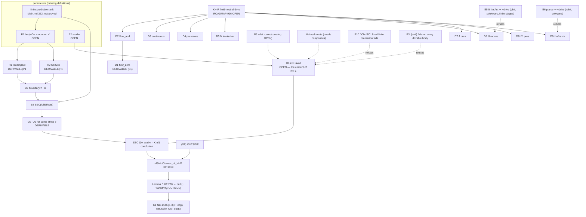

# Thread F — dependency ledger for `KInf1` (read-only research; certified main `6d0abf6b`)

Scope: `KInf1` as landed in `verification/lean-mathlib/OIBridge/KInfFoundations.lean` at
`6d0abf6ba5467e0b0c1f5437a03ae6bd22f9c28a`. Nothing here is governed. No round is proposed. Line numbers are at `6d0abf6b`
(abbreviated `KF:` for `KInfFoundations.lean`).

Evidence levels, never merged: **kernel** (a landed identifier), **exact** (`f_countermodels.py` in this directory,
or the landed CI probe `verification/lean/kinf2_foundations_probe.py`), **written** (an argument stated here),
**citation**. Status words: PROVED needs a kernel identifier. DERIVABLE means a written argument with a named bridge
lemma that does not exist in the kernel. OPEN means no argument is known, or a definition is missing. OUTSIDE-KInf1
means the item is not a conjunct of `KInf1`, and no conjunct depends on it.

Exact layer: `f_countermodels.py` → `OK -- 39 checks, 8 written notes`. Output is in `f_countermodels.out`. The script
sha256 is `e838242a…efe029`. Written steps are printed as notes and are not counted as checks.

***

## 0. Headline findings

1. **`KInf1` concludes (SEC) and nothing else.** Singleton faces, relative strict convexity, copy naturality,
   composition and the gbit/rebit exclusions are not conjuncts of it (KF:1013–1015).
2. **The drive antecedent decides no truth value except by vacuity.**
   - With the full effects in finite dimension, (SEC) holds for every compact convex body, drivable or not (bridge B8).
   - With the unit alone, (SEC) fails on every compact convex drivable body (bridge B3, generalizing
     `not_kInf1_ball3_unit`).
   - So the kernel's positive control `kInf1_ball3_full` is an instance of a drive-free theorem.
   - The "field-neutral Naimark step" that K∞-1 is meant to name (drive ⇒ sharp effects) cannot be stated in the
     landed vocabulary. `avail` is an unconstrained parameter with no link to the flow, and the module has no
     composite, ancilla or readout. All content of `KInf1` for the completion therefore sits in one missing
     definition, the completion's effect family (P2), and in one conclusion atom, availability (O1).
3. **`KInf1` is vacuous on every finite stage.**
   - A polytope has a finite automorphism group, so no drive exists on it. The argument uses no continuity:
     `N = flow(t₀/m)^m` restricts to `g^m = id` (bridge B5).
   - No finite-stage body can therefore test `KInf1`.
   - On a fixed finite *ontic* realization whose body is the Bloch ball, `KInf1` is **false** for the response
     effects. The ball is drivable, and a response effect certain at a full-support state is identically one (kernel
     `response_eq_one_forces`, KF:899; CM-SIC). This is the corpus's finite-substratum obstruction (`Main.md:538–540`)
     in `KInf1`'s own terms.
4. **No body of affine dimension ≤ 2 is drivable.** This is written, with exact identities (BR-FIN, BR-DISK).
   - Finite automorphism group: the exponent argument above.
   - Planar body with infinite automorphism group: every flow member is a square, hence a rotation; an
     `O(2)`-conjugate of a rotation is `R^{±1} = flow(±t)`, so `J_off_axis` fails.
   - The square gbit, the rebit disk, the triangle (classical trit) and the pentagon are all excluded *at the drive
     antecedent*. `KInf1` holds vacuously on them for every effect family.
   - With `ball3_drivable`, dimension 3 is the sharp threshold.
5. **`KInf1 ⇏ RelStrictConvex`.**
   - The bidisk `D×D = conv(S¹×S¹)` (the probe's torus orbitope) is compact, convex and drivable. It has (SEC) with
     its full effects but is not relatively strictly convex (CM-RSC).
   - `RelStrictConvex ⇏ KInf1` holds as well: the ball with the unit alone, kernel.
   - Geometry is independent of `KInf1` in both directions. It enters only at the consumer `relStrictConvex_of_kInf1`
     (KF:1019), through the separate premise (SF).
6. **A hidden typing premise: finite dimension.**
   - `KInf1` needs a normed ambient `V`. The design-note completion `Ω∞ ⊂ [0,1]^{E∞}` carries the product topology,
     which is not normed in general.
   - Matching compactness, and making physical (continuous) effects coincide with Lean's algebraic `V →ᵃ[ℝ] ℝ`, needs
     finite affine dimension of `Ω∞`, that is, finite predictive rank of the completion.
   - `Main.md:352` records this as not proved ("stagewise finiteness does not prove that this completion retains finite
     predictive rank").
   - With continuous effects in infinite dimension, (SEC) fails on a drivable compact convex body (CM-INF).
7. **One structure field is redundant:** `flow_zero` follows from `flow_add` (bridge B1).
8. **Stale status surface, flagged only and not edited:**
   - `verification/ROADMAP.md:997–999` still says the corrected singleton-face statement "is planned for a successor
     foundations round and is not frozen". KINF-2 froze it (KF:139).
   - The K row does not mention KINF-2 at all. KINF-2 itself stated it edits no roadmap row (result.md:18), so the row
     is behind the landed kernel (§A.25).

***

## 1. `KInf1` fully unfolded (KF:1013–1015, with KF:116–150 and KF:264–276)

```
KInf1 Ω avail  ≡
  IsCompact Ω →                                                         -- H1
  Convex ℝ Ω →                                                          -- H2
  (∃ (flow : ℝ → V ≃ᵃ[ℝ] V) (t₀ : ℝ) (J : V ≃ᵃ[ℝ] V),                     -- H3 = Nonempty (ElementaryDrivability Ω)
      flow 0 = refl                                                     -- D1  (KF:266)
    ∧ ∀ s t, flow (s + t) = (flow t).trans (flow s)                      -- D2  (KF:267)
    ∧ Continuous (fun q : ℝ × V => flow q.1 q.2)                         -- D3  (KF:268)
    ∧ ∀ t, ∀ x ∈ Ω, flow t x ∈ Ω                                         -- D4  (KF:269)
    ∧ ∀ x ∈ Ω, flow t₀ (flow t₀ x) = x                                   -- D5  (KF:270–271)
    ∧ ∃ x ∈ Ω, flow t₀ x ≠ x                                             -- D6  (KF:272)
    ∧ ∀ x ∈ Ω, J x ∈ Ω                                                   -- D7  (KF:273–274)
    ∧ ∀ x ∈ Ω, J.symm x ∈ Ω                                              -- D8  (KF:275)
    ∧ ∃ t, ∀ s, ∃ x ∈ Ω, J (flow t (J.symm x)) ≠ flow s x) →             -- D9  (KF:276)
  ∀ x : V,
    ( x ∈ Ω                                                             -- B1  given (KF:131)
    ∧ ∃ y ∈ Ω, ∀ ε : ℝ, 0 < ε → x + ε • (x - y) ∉ Ω ) →                  -- B2  given (KF:131)
    ∃ e : V →ᵃ[ℝ] ℝ,
        e ∈ avail                                                       -- O1  (KF:136)
      ∧ ∀ z ∈ Ω, 0 ≤ e z                                                -- O2  (IsEffectOn, KF:117)
      ∧ ∀ z ∈ Ω, e z ≤ 1                                                -- O3  (IsEffectOn, KF:117)
      ∧ ∃ w ∈ Ω, e w < 1                                                -- O4  (IsProperOn, KF:126)
      ∧ e x = 1                                                         -- O5  (KF:136)
```

Two parameters make the statement about the completion rather than about an arbitrary pair:
- **P1**: the body `Ω` together with its normed ambient `V`, read as the completion `Ω∞`;
- **P2**: the family `avail`, read as the completion's available effects `avail∞`.

**The atoms, numbered.** There are N = 18 atomic obligations: P1, P2, H1, H2, D1–D9 and O1–O5.
- **Proving `KInf1`** for a pair needs P1, P2 and O1–O5. The H/D atoms are then hypotheses.
- **Using `KInf1`**, which is what `relStrictConvex_of_kInf1` (KF:1019) does, also needs H1, H2 and D1–D9 discharged
  for the body. Otherwise the conclusion is reached only vacuously, or not at all.
- B1 and B2 are supplied by the quantifier and are not obligations.
- The atoms are not independent:
  - O1–O5 share one witness `e`. O1 is the *coupling* atom: it is the only one that mentions `avail`.
  - D1 follows from D2 (bridge B1).
  - D9 forces the flow to be nontrivial on `Ω`, but not at `t₀`. D5, D6 and D9 are independent: the ball drive with
    `t₀ = 2π` violates only D6, and with `t₀ = π/2` violates only D5.

***

## 2. The ledger

The target row reading is **R-phys**: `KInf1 Ω∞ avail∞` for the field-neutral completion, which is what hypothesis
K∞-1 means. The three other regimes are recorded in §2.1 so that PROVED cells are never borrowed across them.

| # | `KInf1` clause | exact Lean definition / theorem | immediate dependency | upstream source / provenance | status (R-phys) | proposed bridge theorem | countercontrol |
| --- | --- | --- | --- | --- | --- | --- | --- |
| P1 | the body `Ω`, with normed ambient `V`, is the completion `Ω∞` | none. `FiniteStage.states` (KF:84) is the only body constructor, and finite stages only | a directed system of finite stages and its closed convex hull; a **normed** ambient with compactness matching the operational topology | design note §2 (not authoritative); `Main.md:352`: finite predictive rank of the completion is **not** proved; ROADMAP:995–1015 | OPEN (missing definition plus missing finite-rank premise) | `def completionBody`, with `[FiniteDimensional ℝ V]` justified by a finite-predictive-rank theorem | CM-INF: without finite dimension, continuous effects fail (SEC) on a drivable compact body |
| P2 | `avail` is the completion's effect family `avail∞` | none. KINF-2 result.md:66 records "which effects the completion makes available" as open | a rule generating effects from the drive (orbit closure or attach-then-readout); no such vocabulary exists | ROADMAP:1011–1013 (the field-neutral analogue of the matrix chain is open); KINF-2 prereg:77–82 (Hazard 3) | OPEN (missing definition) | `def availInf`, then B9 (orbit route) or a Naimark-route definition (needs composites) | `{unit}`: false on every drivable body (B3). The SIC response family: false (CM-SIC). Orbit of a point-exposing seed: false (CM-ORB) |
| H1 | `IsCompact Ω` | Mathlib `IsCompact`. Instances: `FiniteStage.states_isCompact` KF:87, `ball3_isCompact` KF:333 | P1. Heine–Borel in finite dimension | `supportingEffectComplete_of_isOpen` KF:625: why compactness is a premise | DERIVABLE given P1 (blocked by P1) | `completionBody_isCompact` (closed and bounded in finite dimension) | CM-CPT: `ball3 × [0,∞)` is drivable, closed and convex, and (SEC) fails even with full effects |
| H2 | `Convex ℝ Ω` | instances `FiniteStage.states_convex` KF:95, `ball3_convex` KF:322 | P1 | design note §2: convex "by construction" | DERIVABLE given P1 | `completionBody_convex` (`Convex.closure` of `convex_convexHull`) | non-convex body: the kernel's L4 (KF:575) needs `hconv` |
| D1 | `flow_zero` | field KF:266. Instance `ball3Drive.flow_zero` KF:451 | D2 | — | DERIVABLE from D2 (redundant field) | B1 `ElementaryDrivability.flow_zero_of_add`: `flow 0 = flow 0 ∘ flow 0` and `flow 0` is invertible | none needed (algebraic) |
| D2 | `flow_add` (group law) | field KF:267. Instance KF:452 | the completion's reversible maps | K∞-R, ROADMAP:996; matrix analogue `DrivesElementary` SubstratumSource:77 (transition flows) | OPEN | matrix regime only: B12 `blochDrivability_of_drivesElementary` | KINF-1's "rotate-and-shrink path" (prereg:141): without D2 the square passes |
| D3 | `flow_continuous` | field KF:268. Instance KF:454–462 | D2 | K∞-R | OPEN | B12 (matrix regime) | not load-bearing for the exclusions: B5 and B6 use none (§4) |
| D4 | `flow_preserves` | field KF:269. Instance `rotFun_mem_ball3` KF:376 | D2 | K∞-R | OPEN | B12 | — |
| D5 | `N_involutive` (with `t₀`) | fields KF:270–271. Instance KF:464–472 | D2, D4 | "the native NOT lies on the flow" (design note §3, §6) | OPEN | B12 | ball drive with `t₀ = π/2`: D5 fails, the others hold |
| D6 | `N_moves` | field KF:272. Instance KF:473–477. Fails: `not_drivable_Icc` KF:529, `not_drivable_singleton` KF:564 | D2, D4, D5 | K∞-R | OPEN | B5 `not_drivable_of_finite_aut` (the exclusion side) | polytopes, by BR-FIN: D6 fails on every finite stage |
| D7 | `J_preserves` | field KF:273–274. Instance `cyc3_mem_ball3` KF:434 | the completion's reversible maps | the quarter phase moves the axis (design note §3) | OPEN | B12 | — |
| D8 | `J_symm_preserves` | field KF:275. Instance KF:440 | D7 | KINF-2 prereg:141: a contracting `J` passes without D8 | OPEN | B12 | KINF-2 probe §6 `disk.frozen.*` (contracting `J`) |
| D9 | `J_off_axis`, compared on `Ω` | field KF:276. Instance KF:481–487 | D2, D7, D8 | KINF-2 prereg:141, 153–158 | OPEN | B6 `not_drivable_planar` (the exclusion side) | BR-DISK: on every planar body `J flow t J⁻¹ = flow(±t)` |
| O1 | `e ∈ avail` | `SupportingEffectComplete` KF:135–136 | P2; and, given B8, "some supporting effect is available at each boundary state" | the only atom that mentions `avail`; K∞-1 = KF:1008–1012 docstring; ROADMAP:1011–1013 | OPEN | B9 `supportingEffectComplete_of_orbit` (needs a covering hypothesis), or a Naimark-route lemma | `not_kInf1_ball3_unit` KF:1089 (kernel); B3; CM-SIC; CM-ORB |
| O2 | `0 ≤ e` on `Ω` | `IsEffectOn` KF:116–117 | the witness supplied for O1 | — | DERIVABLE (B8 supplies a witness among all affine maps) | B8 `supportingEffectComplete_fullEffects` | CM-CPT: no witness without compactness (boundedness) |
| O3 | `e ≤ 1` on `Ω` | `IsEffectOn` KF:116–117 | as O2 | — | DERIVABLE (B8) | B8 | as O2 |
| O4 | `e` proper: `∃ w ∈ Ω, e w < 1` | `IsProperOn` KF:125–126; L1 `not_isProperOn_of_eq_one` KF:199 | the support at `x` is nontrivial on `Ω`, which needs `x` not in the relative interior | L2/L3 KF:210, 227: certain plus proper implies boundary (the converse direction is B7) | DERIVABLE (B7 + B8) | B7 `isBoundaryState_iff_not_mem_intrinsicInterior` | the unit: `not_isProperOn_const_one` KF:206 |
| O5 | `e x = 1` | KF:136 | the supporting functional, normalized | — | DERIVABLE (B8) | B8 | CM-INF: with continuous effects in infinite dimension, no witness |

### 2.1 The same atoms in the other three regimes (no cross-borrowing)

| regime | P1 | P2 | H1, H2 | D1–D9 | O1–O5 | identifiers |
| --- | --- | --- | --- | --- | --- | --- |
| **R-ctl**: ball3 with its full effects | `ball3` KF:311 | `fullEffects` KF:149 | PROVED | PROVED (`ball3Drive` KF:449, `ball3_drivable` KF:490) | PROVED (`supportingEffectComplete_ball3` KF:1053) | `kInf1_ball3_full` KF:1076 |
| **R-full**: any compact convex `Ω`, `fullEffects Ω`, finite-dimensional `V` | any | `fullEffects` | hypotheses | hypotheses, *unused* | O1 holds by definition (`fullEffects` KF:149). O2–O5 DERIVABLE (B7, B8) | none; this is B8 |
| **R-mat**: Bloch ball, effects of a theory generated by a `QuantumArchitecture` (imported ℂ) | Bloch image of density matrices | Bloch image of the effects of `genTheory 𝓘` | DERIVABLE | DERIVABLE via B12 from `DrivesElementary` (SubstratumSource:77) | DERIVABLE via B13 from `genTheory_qm_of_quantumArchitecture` (SubstratumSource:136) and `readout_is_localLuders` (OperationalAssembly:658) | none bridging to `KInfFoundations`; it is a leaf module (only `OIBridge.lean:246` imports it) |
| **R-phys**: the field-neutral completion (the target) | OPEN | OPEN | DERIVABLE given P1 | D1 DERIVABLE; D2–D9 OPEN | O1 OPEN; O2–O5 DERIVABLE (B8) | none |

R-mat is not a discharge of K∞-1: it presupposes the complex matrix kinematics that K exists to reach (ROADMAP:973–976).
It is the matrix witness (design note §13) restated in `KInfFoundations` vocabulary, and it would need the Bloch
translation, which does not exist.

***

## 3. Bridge theorems proposed (none exists at `6d0abf6b`)

All are written arguments here. "Cheap" means elementary Mathlib, no measure theory.

| id | statement (Lean-style) | argument | evidence here | cost |
| --- | --- | --- | --- | --- |
| B1 | `ElementaryDrivability.flow_zero_of_add : (∀ s t, flow (s+t) = (flow t).trans (flow s)) → flow 0 = refl` | `flow 0 = flow 0 ∘ flow 0`; cancel the equivalence | written | cheap |
| B2 | `exists_isBoundaryState_of_drivable : IsCompact Ω → Convex ℝ Ω → Nonempty (ElementaryDrivability Ω) → ∃ x, IsBoundaryState Ω x` | `N_moves` gives two states; Krein–Milman gives an extreme point `x`. For `y ≠ x`, `x + ε(x−y) ∈ Ω` would put `x` strictly inside a segment | written | cheap (Mathlib `IsCompact.extremePoints_nonempty`) |
| B3 | `not_kInf1_unit_of_drivable : IsCompact Ω → Convex ℝ Ω → Nonempty (ElementaryDrivability Ω) → ¬ KInf1 Ω {const 1}` | B2 together with L1 (KF:206); generalizes `not_kInf1_ball3_unit` | kernel instance KF:1089 | cheap |
| B4 | `kInf1_of_isEmpty_drivability : IsEmpty (ElementaryDrivability Ω) → KInf1 Ω avail`; with KF:678 and KF:529, `KInf1 (Icc (-1) 1) {const 1} ∧ ¬ SupportingEffectComplete (Icc (-1) 1) {const 1}` | vacuity | kernel ingredients KF:529, KF:678 | trivial |
| B5 | `not_drivable_of_finite_aut`: if the restrictions to `Ω` of the affine automorphisms preserving `Ω` (with inverse) form a finite group, then `IsEmpty (ElementaryDrivability Ω)`. Corollaries: `not_drivable_polytope` (`convexHull` of a finite range, finite dimension), `FiniteStage.kInf1_vacuous` | `flow(t₀/m)^m = flow t₀` by D2; `g^m = id` for `m = |G|`; so `N` fixes `Ω`, contradicting D6. No continuity used | exact BR-FIN: square `|G| = 8`, triangle `|G| = 6`, `g^m = id` enumerated; mutation: a disk rotation of infinite order | moderate (restriction group; polytope automorphisms permute vertices) |
| B6 | `not_drivable_planar`: affine dimension of `Ω` ≤ 2 ⇒ not drivable. Special case `not_drivable_disk` | finite group ⇒ B5. Otherwise the group is compact, so it is orthogonal for an invariant inner product; every flow member is a square (D2), hence a rotation; `J R J⁻¹ ∈ {R, R⁻¹} = {flow t, flow(−t)}` on `Ω`, so D9 fails. No continuity used | exact BR-DISK identities; mutation: a shear conjugates `R` to neither | disk alone: moderate (an affine bijection of the disk fixes the centre and is orthogonal). General planar: costly (invariant inner product) |
| B7 | `isBoundaryState_iff_not_mem_intrinsicInterior [FiniteDimensional ℝ V] (hconv : Convex ℝ Ω) (hx : x ∈ Ω)` | Rockafellar Thm 6.4: `z ∈ ri C` ⇔ every segment from `C` through `z` extends | written, citation | moderate |
| B8 | `supportingEffectComplete_fullEffects [FiniteDimensional ℝ V] : IsCompact Ω → Convex ℝ Ω → SupportingEffectComplete Ω (fullEffects Ω)`, hence `kInf1_fullEffects` | B7, then a nontrivial supporting hyperplane at a relative-boundary point (Rockafellar 11.6; in Lean, separate within `affineSpan` by `geometric_hahn_banach_open_point` and extend), then normalize `(f − min)/(f x − min)` using compactness | kernel instance KF:1053 (ball). Exact countercontrols CM-CPT and CM-INF show compactness and finite dimension are load-bearing | moderate to costly |
| B9 | `supportingEffectComplete_of_orbit`: given a group `G` of automorphisms of `Ω`, a family `avail` closed under `e ↦ e ∘ g⁻¹`, seeds `S ⊆ avail` of proper effects, and **covering** (every boundary state is in `g(certainFace e)` for some `g ∈ G` and `e ∈ S`), conclude (SEC) | transport of certain faces | exact CM-ORB: covering is **not** implied by drivability plus transitivity on extreme points | cheap; the covering hypothesis is OPEN |
| B10 | `not_supportingEffectComplete_response`: `Ω ⊆ simplex N`, `Ω` has two states, a boundary state with full support ⇒ ¬(SEC) for response effects | kernel `response_eq_one_forces` KF:899, as in `exists_zero_of_classicallyExposed` KF:924 | exact CM-SIC; landed probe §7 `sic.*` | cheap |
| B11 | `bidisk_kInf1_not_relStrictConvex`: the bidisk is compact, convex and drivable, has (SEC) with full effects, and is not `RelStrictConvex` | the effect `(1+u·x)/2` at `|u| = 1`; L5/L9 pattern | exact CM-RSC; landed probe §4 `torus.*` (drive and (SF) failure) | moderate (four-dimensional Euclidean algebra, as for `ball3`) |
| B12 | `blochDrivability_of_drivesElementary` (imported ℂ): the transition flow, swap and quarter phase on `Fin 2`, conjugated and read on the Bloch ball, form an `ElementaryDrivability` | the conjugation of `flow (transition 0 1) t` is a rotation about one axis; the phase conjugation moves the axis | written | moderate; it sources nothing field-neutral |
| B13 | `kInf1_bloch_of_quantumArchitecture` (imported ℂ) | the rank-one projective effects of `genTheory` give `(1 + r·v)/2` at each pure `r` | written | moderate; not a discharge of K∞-1 |

***

## 4. Countermodels for the implications that fail

All are exact in `f_countermodels.py`, or kernel where stated. Each names the missing premise.

| id | implication tested | countermodel | verdict | missing premise |
| --- | --- | --- | --- | --- |
| (kernel) | drivable compact convex ⇒ (SEC) for any `avail` | ball3 with `{unit}`: `not_kInf1_ball3_unit` KF:1089; uniform version B3 | fails | a richness and closure premise on `avail` (P2) |
| CM-RSC | `KInf1 ⇒ RelStrictConvex` (equivalently `KInf1 ⇒ (SF)`) | bidisk `D×D`, full effects. Drive `R_t ⊕ I`, `N = R_π ⊕ I`, `J = swap`. (SEC) by `(1+u·x)/2`. The midpoint `(e₁,0)` of `(e₁,±e₁)` is a boundary state | fails (13 checks) | (SF), a separate premise (KF:1021) |
| CM-ORB | drive + `avail` orbit-closed + one proper seed + transitivity on extreme points ⇒ (SEC) | bidisk; seed `(2+x₀+y₀)/4`. The orbit `{(2+u·x+v·y)/4}` is ≤ 3/4 at `(e₁,0)`. Mutation: the face seed `(1+x₀)/2` covers | fails (6 checks + 2 notes) | covering of the boundary by orbits of certain faces. With strict convexity as input, B9 becomes circular with Lemma C (KF:575) |
| CM-CPT | (SEC) with full effects without compactness (B8's hypothesis) | `ball3 × [0,∞)`, drivable (`rot3 × id`). At `z = 0`, every effect certain there is ≡ 1 | fails (5 checks + 1 note) | compactness (boundedness) |
| CM-INF | B8 without finite dimension, for continuous effects | Hilbert cube `{|vₙ| ≤ 2⁻ⁿ}` × ball3 in `ℓ² × ℝ³`; `xₙ = 2⁻ⁿ(1−1/n)` is a boundary state, and every continuous affine effect certain there is constant | fails; written argument, 2 truncation checks | finite dimension. With Lean's *algebraic* effects, algebraic Hahn–Banach supplies a witness on this body, so the infinite-dimensional algebraic case stays OPEN and is not needed |
| CM-SIC | drivable body + effects of a fixed finite ontic realization ⇒ (SEC) | SIC Bloch ball in `Δ₃`; `p(e₃)` has full support (exact in `ℚ(√3)`). Kernel KF:899 makes every certain response effect the unit | fails (2 checks + 1 note; landed probe §7) | an effect completion beyond any fixed finite realization (`Main.md:538–540`) |
| BR-FIN / BR-DISK | the exclusions: square, triangle, disk not drivable | not countermodels to `KInf1`; they show `KInf1` is *vacuous* on these bodies | exclusions hold (11 checks + 3 notes) | — |

***

## 5. Where geometry, composition and the exclusions sit (decided)

**Relative strict convexity (and (SF)): OUTSIDE-KInf1.**
- *Logical necessity: none.*
  - CM-RSC: `KInf1` holds on a non-RSC body.
  - Kernel: the ball with `{unit}` is RSC and fails `KInf1`.
- *Position:* RSC is the conclusion of the consumer `relStrictConvex_of_kInf1` (KF:1019–1023), which takes (SF) as
  its own premise. RSC then feeds Lemma B (KF:770) toward the ball, together with a transitivity premise that the
  kernel does not have.
- *Route caution:* if P2 is sourced by the orbit route (B9), covering must come either from strict convexity, which
  is circular with Lemma C (KF:575), or from boundary transitivity. Boundary transitivity gives the ball by Lemma B
  directly, and with it (SF), so (SF) becomes redundant. Under that route, geometry would sit upstream of O1. This is
  a route constraint, not a conjunct.

**Composition and copy naturality: OUTSIDE-KInf1.**
- *Logical necessity: none.* `CopyNatural` (KF:284) is not referenced by `KInf1`. `KInfFoundations` has no composite,
  tensor, ancilla or readout. `KInf1` is proved for the ball with no second copy (KF:1076).
- *Position:* copy naturality sits at K1 (NB-1: "one common NOT", ROADMAP:984–990; census note on `NativeGateBall`),
  downstream of the ball.
- *Route caution:* a field-neutral **Naimark** sourcing of P2 (attach, controlled transition, readout) would bring a
  composite with a native gate upstream of O1, and with it the copy question. NB-1 shows that two NOTs admit `d = 5`.
  At the matrix level the sharp effects do come through composites (`control_of_lieRank`, MicroscopicReversibility:114;
  `circuit_available`, OperationalAssembly:757). The orbit route (B9) avoids composition but needs covering.

**gbit and rebit exclusions: OUTSIDE-KInf1, at the drive antecedent H3.**
- They are failures of D6 (finite automorphism group: square, triangle, every polytope; B5) or of D9 (the disk and
  every planar body; B6). `KInf1` is vacuously true on them for every `avail`, so it neither performs nor needs these
  exclusions.
- Kernel status:
  - only the classical bit's exclusion is kernel (`not_drivable_Icc` KF:529);
  - the square and disk exclusions remain the written obligation of KINF-2 (prereg:145–165; result:64);
  - B5 and B6 give continuity-free routes to discharge it.
- The square is excluded a second time, independently, by (SF): `not_singletonFaces_square` KF:726.
- Cross-propagation note (assumption-watch, outside `KInf1`): NB-1 gives `d ∈ {1,3}` for balls. Drivability excludes
  `d = 1` (kernel KF:529), and by B6 every `d ≤ 2`. So drivability plus K1 give `d = 3`, still conditional on K1's own
  premises (copy covariance among them).

***

## 6. Dependency graph



Text form:

```
FR(finite rank) → P1 → {H1, H2} → B7 → B8 → O2..O5 ─┐
P2 ───────────────────────────────────────→ O1 ─────┴→ SEC = KInf1 conclusion → [+SF] RSC → [+transitivity] Lemma B ball → [+copy nat.] K1
K∞-R → D2 → D1 ; K∞-R → D3..D9      (antecedents; B5 kills D6 on polytopes, B6 kills D9 in dim ≤ 2)
```

***

## 7. Recommended theorem order

The cheap, instance-independent facts come first: they fix what the missing definitions must satisfy. The
definitions, where the openness actually lives, come last.

1. **B1** `flow_zero_of_add`. Removes a redundant obligation.
2. **B2, B3** boundary-state existence on drivable bodies; `¬ KInf1 Ω {unit}` uniformly. B3 makes the
   negative control structural rather than one instance.
3. **B4** vacuity, with the `Icc`/unit pair. This exhibits the antecedent as load-bearing in the definition.
4. **B5** `not_drivable_of_finite_aut` → `not_drivable_polytope` → `FiniteStage.kInf1_vacuous`, and the square
   half of KINF-2's written obligation.
5. **B6** `not_drivable_disk` (the rebit half), then the general planar statement if wanted.
6. **B7, B8** relative boundary and `supportingEffectComplete_fullEffects` under `[FiniteDimensional ℝ V]`, with
   CM-CPT and CM-INF as controls. After B8 the whole open conclusion of `KInf1` is O1.
7. **B10** the response-family no-go, which rules out every fixed finite realization as P2. **B11** the bidisk
   separation `KInf1 ⇏ RSC`, which records geometry as outside.
8. **B9** the orbit-route lemma with its covering hypothesis named, with CM-ORB as countercontrol.
9. **B12, B13** the matrix-regime Bloch bridges, labelled imported kinematics, as the R-mat witness only.
10. **P1, P2** the completion body (with a finite-predictive-rank premise or theorem) and the completion's effect
    family. Only after these can a statement `KInf1 Ω∞ avail∞` be posed, and O1 attacked.

***

## 8. Summary

Of **N = 18** atomic obligations in `KInf1` (read for the field-neutral completion), **X = 0** are already
discharged in the kernel. **Y = 7** follow from specific bridge lemmas, given the other rows:
- D1, by B1 `flow_zero_of_add`;
- H1 and H2, by `completionBody_isCompact` and `completionBody_convex` once P1 exists;
- O2, O3, O4 and O5, by B7 `isBoundaryState_iff_not_mem_intrinsicInterior` and B8
  `supportingEffectComplete_fullEffects` in finite dimension.

**Z = 11** remain genuinely open:
- P1, the completion body, which carries the finite-predictive-rank premise of `Main.md:352`;
- P2, the completion's effect family;
- O1, availability of a supporting effect;
- D2–D9, field-neutral drivability K∞-R.

In the control regime (ball3 with full effects) all 18 are PROVED (`kInf1_ball3_full`, `ball3Drive`,
`ball3_isCompact`, `ball3_convex`).

Geometry, composition and the exclusions belong at these exact positions:
- relative strict convexity and (SF) at the consumer `relStrictConvex_of_kInf1` (KF:1019) and beyond (Lemma B);
- composition and copy naturality at K1 (NB-1), downstream of the ball, and upstream of O1 only if P2 is sourced
  by a Naimark route;
- the gbit and rebit exclusions at the drive antecedent, D6 for polytopes (B5) and D9 for planar bodies (B6),
  where `KInf1` is vacuous.
