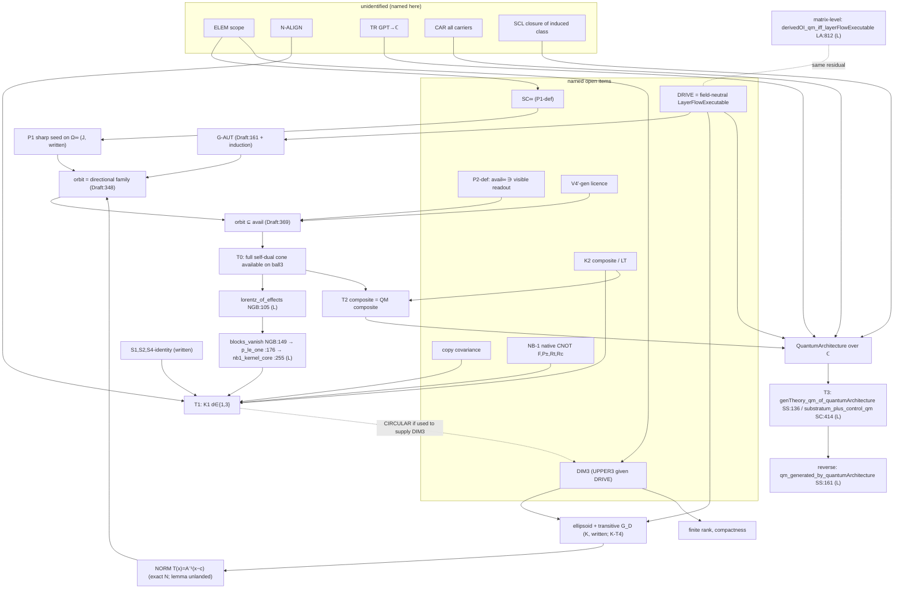

# Thread M — full-equivalence dependency audit (read-only; certified main 6d0abf6b)

Lines are at `6d0abf6ba5467e0b0c1f5437a03ae6bd22f9c28a`, under `verification/lean-mathlib/OIBridge/` unless a path is
given. Abbreviations: KF = KInfFoundations, NGB = NativeGateBall, SS = SubstratumSource, SC = StructuralClosure,
OA = OperationalAssembly, LA = LiftAudit, LOS = LevelOneSeam, RT = RegionTower, Draft = threads/L/OrbitGeneration.lean.

Evidence levels:
- **kernel**: a landed identifier;
- **draft**: L's uncompiled Lean (its CI design run is in progress elsewhere and was not awaited);
- **exact**: `m_checks.py` here, `OK -- 50 checks, 0 failed, 8 written notes`, replay identical (`rerun.out`),
  sha256 `599b6ced…bdcd2` (script) and `46c452e4…71fe` (output);
- **written**: an argument stated here.

Nothing here is a kernel result unless it names a landed identifier. Every I–L claim used was re-verified in the
tree (NOTES.md lists the identifiers). Corrections to the inputs are in §9.

***

## 1. Finding

The forward chain stops being kernel at its first link, and none of the four ingredients is SOURCED.
- **P1/SC∞** is OPEN: no stage maps or completion exist (`FiniteStage` KF:63 is used only in KF).
- **K∞-R** is OPEN at its source:
  - the drive. Its matrix shadow `LayerFlowExecutable` (LA:112) is refuted for the current substratum
    (`substratumTheory_not_layerFlowExecutable` LA:200, `substratum_residual` SC:383);
  - dimension 3. Nothing landed fixes it. The drive gives only d ≥ 3. Taking d = 3 from NB-1 is CIRCULAR, as
    traced in §4.
- **G-AUT** is not an independent premise. It is a field of the drive, so it is sourced exactly as far as the
  drive is.
- **V4′** is OPEN. It is a licence, and nothing landed supplies it.

Of the three traps:
- **normalization** is genuinely free. It is a coordinate choice, checked exactly, provided every object is pushed
  through the same affine map;
- **dimension 3** needs its own named source. It is the one place the chain would otherwise close a loop;
- **G-AUT** reduces to drive sourcing.

From `lorentz_of_effects` (NGB:105) to the final target the corpus has:
- one kernel consumer chain, `blocks_vanish` → `p_le_one` → `nb1_kernel_core`. It runs at p = dim V₊ ≥ 2, so
  at d = 3 it is not invoked;
- then the written NB-1 steps, K2 (OPEN), and a GPT → ℂ-matrix translation plus an all-carrier extension. That
  last part is unnamed in the ROADMAP;
- then the landed but conditional K3 endpoint (`genTheory_qm_of_quantumArchitecture` SS:136,
  `substratum_plus_control_qm` SC:414).

**Reverse implication.** Every forward premise holds in the qubit model, with exact checks and the kernel
identifiers listed in §6. There is no fatal finding for the chain as scoped. But the scope is load-bearing:
- K∞-R, DIM3 and the ROADMAP's singleton-face principle are **false in QM** when stated for an arbitrary system's
  body (qutrit), or for the dilated block readout P₀ ⊗ 1;
- the elementary-system scope (ELEM) must therefore be a premise row. It is currently unnamed.

***

## 2. The final target, located

| level | statement | status | where |
| --- | --- | --- | --- |
| T0 | the directional family {(1 + b·x)/2 : Σb² = 1} is *available* on the elementary body, in ball coordinates. This is the single-copy input of NB-1 (full self-dual cone) | conditional (L draft + I–K) | Draft `seedOrbit_ball3_eq` :348, `ballEffect_mem_avail` :369 |
| T1 | K1: d ∈ {1, 3} for two LT d-balls with full self-dual cones, one common N and a native CNOT G with F, P±, Rt, Rc | CONDITIONAL. Kernel core only: `nb1_kernel_core` NGB:255. S1, S2 and the S4 value identity are written | NB-1 result.md; ROADMAP:984 |
| T2 | K2: the composite of identical elementary systems is the complex-QM composite | OPEN, no governed round | ROADMAP:991–994 |
| T3 | **the final target** (ROADMAP P1, :68). "Complex quantum kinematics in the conclusion rather than the premises": reach a `QuantumArchitecture` on ℂ matrix carriers, whence `ExactAllFiniteEndomorphicQuantumOps` (LOS:186) on every nonempty carrier | K3 CONDITIONAL, with the landed endpoints `genTheory_qm_of_quantumArchitecture` SS:136 and `substratum_plus_control_qm` SC:414 (Main.md anchor, census family 6); reverse `qm_generated_by_quantumArchitecture` SS:161 | ROADMAP:978–983; Main.md:352, :542 |

**Matrix-level comparison.** The kernel already has an equivalence one level down:
- `derivedOI_qm_iff_layerFlowExecutable` (LA:812): under `DerivedOI` (RouteB:141) and `SubstratumAvail` (LA:745),
  exact QM ⟺ `LayerFlowExecutable T σ`, i.e. one gate flow executable at every time.
- That equivalence has ℂ matrix kinematics in its premises. The field-neutral K route exists to remove them.
- Its DRIVE premise (§3, row K2a) is the field-neutral shadow of the *same* residual. The route removes the
  kinematics; it does not remove the controllability residual.

***

## 3. Premise table (forward chain), with the reverse (quantum-model) status

Tags:
- **L** = landed (identifier, file:line);
- **C[x]** = conditional on the named open item x;
- **U** = unidentified gap, i.e. not named anywhere in the corpus. Each U row is named here for the first time.

"Rev." gives the status in the qubit model, from exact checks (§6) or kernel.

### 3a. Up to T0, the four ingredients and their sub-rows

| # | premise / link | used by | tag | evidence | Rev. (QM) |
| --- | --- | --- | --- | --- | --- |
| P1a | **SC∞**: a directed system of `FiniteStage`s with functorial forward maps, p_τ(ιe, ιs) = p_σ(e, s) | the seed's 1/0 values on Ω∞ | C[SC∞] | J (written chain J1–J6; countermodel C1a). No stage maps in the kernel; matrix analogue only: `Consistent` RT:319, `trace_inclObs_mul_restrict` RT:190 | holds by construction (Q7a note; RT analogue kernel) |
| P1b | Ω∞ := cl conv{p(·\|s)} ⊂ ℓ^∞(E∞), convex | the body | C[SC∞] (definition missing) | J candidates `completionBody`, `completionBody_convex` | holds |
| P1c | seed π = evaluation at ι e_v is an effect, 1 at x_v, 0 at x_v′, so `SharpSeed` (P1 *with the zero value*: L O2) | L ⊆ and ⊇ | C[SC∞] | J J3–J5; Draft `sharpSeed_of_perfectlyDistinguishable` :129 | holds: P₀ = (I+Z)/2, values 1 and 0 (Q1); the readout is a projector, `readout_is_localLuders` OA:658 (kernel) |
| P2 | **avail∞ defined**, and the visible readout ∈ avail∞ | V4′-gen's "r ∈ avail" | C[P2-def] | F P2 OPEN | holds: all qubit effects available (`ExactFiniteEndomorphicQuantumOps`, from SS:136 + SS:151) |
| ELEM | **scope**: Ω∞ is the body of a system with binary visible alphabet, read on the visible factor alone (no ancilla or hidden effects in E∞) | K∞-R, DIM3, BODY | **U** | exact X1–X4: false for the qutrit body and for the dilated readout P₀ ⊗ 1 (Main.md:240 form) | holds for the qubit visible factor (X4b); **fails unscoped** |
| K2a | **DRIVE**: an `ElementaryDrivability` (KF:264, D1–D9, D3 included) on Ω∞ in the theory's reversible maps | G-AUT, transitivity, V4′-gen | C[drive sourcing]. K's `elementaryDrivability_of_substratum`, sharpened: **not** from the current substratum. Its matrix shadow fails there (LA:200; SC:383; exact S1–S3); it can come only from an extension = `LayerFlowExecutable` (LA:112) at non-integer times | K §3; LA:812 | holds: e^{−iθX}, quarter phase S, N = −iX (Q3a–d); `layerFlowExecutable_of_control` LA:117 (kernel) |
| K2b | **DIM3**: aff dim Ω∞ = 3. Given DRIVE, equivalently **aff dim ≤ 3**, since the drive excludes d ≤ 2 (kernel `not_drivable_Icc` KF:529 and `not_drivable_singleton` KF:564 on their bodies; d = 2 written, B6 / exact D5) | the ellipsoid, transitivity | C[DIM3] (OPEN; §4) | K §2 | holds for the qubit (Q7b, rank 4); **fails unscoped** (qutrit: dimension 8, X2) |
| K2c | transitivity of G_D on ∂Ω∞ in d = 3, and Ω∞ an ellipsoid | L ⊇ (COVER) | DERIVABLE from K2a + K2b (written; K-T4 costly) | K §2, re-derived (NOTES) | holds (Q6) |
| K2d | FR, finite predictive rank (Main.md:352) | compactness, the [FiniteDimensional] typing | implied by K2b (rank = 4) | written | holds |
| K2e | compactness and convexity of Ω∞ | B8 / L | DERIVABLE (closed and bounded in a 3-dim affine span) | F H1/H2 | holds |
| NORM | ellipsoid → `ball3` by T(x) = A⁻¹(x − c), after restricting ℓ^∞(E∞) to aff Ω∞ | L's BODY scope (L O3), the Σb² = 1 index (L O4) | DERIVABLE, a free coordinate choice (§5); unlanded transport lemma | exact N0–N9 | Pauli coordinates are literally `ball3` (Q0) |
| GAUT | **G-AUT**: every g ∈ G_D and g⁻¹ map Ω∞ into Ω∞ (body side) | L ⊆ (`PreservesBody`) | reduces to K2a: Draft `preservesBody_drive` :161, for any D, generators only, + word induction (written) | L O1 (countermodel ½·id) | holds: U·U† and U†·U keep states (Q4) |
| V4 | **V4′-gen**: r ∘ g⁻¹ ∈ avail for g ∈ ⟨flow, J⟩ (effect side) | availability of the orbit only, not the equality | C[V4′-gen licence] | I §2 (independence countermodel avail₀) | holds: U P₀ U† is a projector = ballEffect(R_U e_z) (Q5), available by `ExactFiniteEndomorphicQuantumOps` LOS:186 via SS:136/151 |
| ORB | P1c + K2c + GAUT (after NORM) ⟹ {r∘g⁻¹} = directional family | T0 | draft (`seedOrbit_ball3_eq` :348), CI pending | L; exact l_checks | — |
| AV | ORB + V4 ⟹ every ballEffect b with Σb² = 1 ∈ avail | T0 | draft (`ballEffect_mem_avail` :369) | — | — |

### 3b. From `lorentz_of_effects` to the final target (T0 → T3)

| # | link | tag | note |
| --- | --- | --- | --- |
| LZ | `lorentz_of_effects` NGB:105 | L | dimension-free: p is a parameter, 1 ≤ p (exact D1). The p = 3 instantiation (Draft `lorentz_of_seedOrbit` :406) is a *new* consumer, a single-ball self-duality statement. The corpus's only consumer is below |
| BV | `blocks_vanish` NGB:149 (calls LZ at :164, needs 2 ≤ p) → `p_le_one` :176 → `nb1_kernel_core` :255 | L | its hypothesis `hpos` is *not* T0. It is produced from P± by the S4 value identity. At d = 3 with a drive NOT, split (1,1) and p = 1, so it is not invoked (D2 note) |
| S124 | NB-1 S1 (controlled form), S2 (block structure), S4 value identity, for every d | written proof; exact d ≤ 7 and d = 5, 7 | NB-1 result.md: "not a kernel theorem" |
| NB-H | NB-1 hypotheses: native CNOT G with F, P±, Rt, Rc; invertibility | C[K1 native-gate hypotheses] | the native classical CNOT extended off the frame. The extension is unsourced |
| CC | identical-copy covariance, Σ(N⊗I)Σ⁻¹ = I⊗N | C[copy covariance] (ROADMAP:1000) | normalization cannot supply it (exact N10a/b) |
| NAL | the drive's NOT exchanges the seed's PD pair (N∘r = 1 − r): NB-1's corners are the visible pair | **U** | sourced only if the drive's flow is the gate-flow interpolation of the substratum's visible swap (K §3), i.e. via K2a. Holds in QM (Q3d) |
| LT | locally tomographic composite; product effects available jointly; P± read as max-cone positivity | C[K2] | Main.md:212/:628: causal separation does not establish LT |
| K2 | composite = complex-QM composite (classification, cone theorem, antiunitary/CP bridge) | C[K2] (ROADMAP:991) | OPEN |
| TR | GPT → ℂ translation: the 3-ball and its SO(3) drive → ℂ² with SU(2) conjugation (the reverse of F's B12/B13) | **U** | named only coarsely, as "the relation to the K3 machinery" (ROADMAP:993) |
| CAR | all-carrier extension: every finite carrier Fin n is a system of the theory, and the transition flow, swap and quarter phase are admissible on *every* pair a, b of *every* carrier (`DrivesElementary` SS:77 quantifies over all S, a, b) | **U** | a drive on one elementary system does not give DrivesElementary at every carrier |
| SCL | the induced implementation class is context-, label- and dagger-stable (`StructurallyClosed`) and extends the substratum class | **U** for an OI-built class (landed only for fullClass and substratumClass, SC:316) | needed by `substratum_plus_control_qm` SC:414 |
| K3 | `genTheory_qm_of_quantumArchitecture` SS:136 / `substratum_plus_control_qm` SC:414 | L (conditional theorems) | the endpoint. Reverse: `qm_generated_by_quantumArchitecture` SS:161, `qm_generated_by_substratum_extension` SC:423 (L) |

***

## 4. Verdicts: the four ingredients and the three traps

| item | verdict | why |
| --- | --- | --- |
| (1) P1 / SC∞ | **OPEN** (named: SC∞, plus the P2 definition) | J's chain is written, and SC∞ is its only premise. No stage maps exist (`FiniteStage` KF:63 is used only in KF). The definition is free; the consistency *theorem* for OI's stages is open. Not circular: no dynamics or effects family is used |
| (2) K∞-R + dimension 3 | **OPEN** (drive) + **OPEN** (DIM3); CIRCULAR if DIM3 is taken from NB-1 | the drive: §3a K2a. DIM3: below |
| (3) G-AUT | **reduces to the drive (OPEN)**; not an independent premise, not circular | `preservesBody_drive` (Draft:161) holds for *every* `D : ElementaryDrivability Ω`, not only `ball3Drive`, from D4, D7, D8 and flow(−t) = flow(t)⁻¹. The draft covers the generator set only; the induction over words is written. G-AUT for G_D is therefore exactly as sourced as D. If transitivity were adopted for a bare G (route B, §8), G-AUT would become a separate premise again (L O1, ½·id) |
| (4) V4′ | **OPEN** (named: V4′-gen licence) | I: DERIVED only for the passive ⟨φ⟩ on the finite carrier, not connected to KF `avail`. For the drive: NEEDS-PREMISE, independent (avail₀ countermodel). Defining avail∞ as the seed orbit makes V4′ definitional and moves the same content into the licence of that definition. Not circular |
| trap 1, NORMALIZATION | **SOURCED as a coordinate choice** (written + exact). Unlanded lemma; no physical premise | §5 |
| trap 2, DIMENSION 3 | **OPEN** (name: DIM3, equivalently UPPER3 given the drive). Via NB-1: **CIRCULAR** | §4.1 |
| trap 3, G-AUT / drive availability | **OPEN through drive sourcing**. The current substratum is refuted as a source (kernel at matrix level) | §3a K2a, exact S1–S3 |

### 4.1 Dimension 3: the loop and its only non-circular breaks

The loop, as K showed:
- (drive + **d = 3**) ⇒ ellipsoid + transitive G_D ⇒ ball3 + directional family (L) ⇒ NB-1's input ⇒ d ∈ {1,3}.
- The conclusion re-supplies the premise. For d ≥ 4 a drive does not deliver NB-1's input: on B⁴ with the drive
  Rz⊕1, cyc3⊕1, every orbit direction has b₄ = 0 (exact D3a–b).

Landed constraints:
- d ≥ 1 and d ≠ 1 come from the drive (KF:529, :564, on their specific bodies; the transport to abstract bodies is
  written);
- d ≠ 2 is written (B6; exact D5);
- **no upper bound** is landed. `card_le_two_of_centrallySymmetric` KF:632 bounds capacity, not dimension: every
  d-ball has capacity two.
- Matrix regime: d = n² − 1 = 3 for n = 2, which imports ℂ.

There are two non-circular breaks, each a named premise:
- **Route A, DIM3 (UPPER3).** The elementary body has affine dimension ≤ 3. This is the smallest premise.
- **Route B, TRANS(G_D).** The drive group is boundary-transitive in any dimension.
  - It is consistent in d ≥ 4: a single SO(4) element maps e₁ to (½, ½, ½, ½), exact D4.
  - With TRANS(G_D), the ball follows in every d by the compact-group/John argument (written), and L generalized to
    the d-ball gives the full self-dual cone.
  - NB-1 then gives d ∈ {1,3}, and the drive excludes 1.
  - This route is non-circular. It costs TRANS(G_D), FR, CC, NAL, NB-H, LT and the general-d NB-1 proof (written
    S1, S2 and S4 identity).

`lorentz_of_effects` at p = 3 never sources dimension: it is dimension-free (exact D1), and p = 3 is forced by
BODY = ball3.

***

## 5. Normalization: ellipsoid → ball3 (trap 1)

**The map.** Ω_E = c + A·ball is the ellipsoid in the coordinates where the averaged inner product is standard. The
map is T(x) = A⁻¹(x − c). It is preceded by the restriction of V = ℓ^∞(E∞) to aff Ω∞, which the drive preserves,
because flow(t) and flow(−t) both preserve Ω∞ and hence its affine span.

What the map transports, checked exactly for a non-orthogonal rational A and c = (1,−1,2):

| object | transport | check |
| --- | --- | --- |
| body | T(c + A b) = b; boundary ↔ unit sphere | N1 |
| seed | r_E ∘ T⁻¹ = ballEffect(e_z); values 1 and 0 kept | N2, N7 |
| drive / G | T g T⁻¹ = R ∈ SO(3), with translation 0 | N3 |
| G-AUT | carried along T | N5 |
| `IsBoundaryState` | the extension x + ε(x − y) is affine-covariant | N6 |
| V4′ family | (r_E ∘ g⁻¹) ∘ T⁻¹ = ballEffect(R e_z) | N4 |
| pairing | e(x) = (e ∘ T⁻¹)(T x) | N8c |

The residual choice O ∈ O(3) fixing e_z changes neither the seed nor any Lorentz verdict (N9).

**Hidden premise? No, with two conditions.**
1. The consumer is coordinate-bound.
   - The state c gives |c|² = 6 > 1 in raw coordinates (N8a).
   - The raw directional effect (1 + x₀)/2 takes the value 2 on Ω_E (N8d), as in L's N6.
   - So T must be applied to states and effects together. Applying it to the effects alone is a wrong verdict, not
     a premise.
2. Across copies, independent normalizations do not align the NOTs (N10a). Alignment is CC (copy covariance), a
   named open premise, not a coordinate freedom.
   - For drive NOTs the splits are always (1,1). A drive NOT lies in the identity component, so it is a π-rotation
     (N10 note). B's split mismatch therefore cannot arise; only the token identification is open.

**Not landed.** What would land it:
- an affine-iso transport lemma: `SharpSeed`, `PreservesBody`, `BoundaryTransitive`, `seedOrbit` and `IsEffectOn`
  are invariant under conjugation by `V ≃ᵃ W`;
- a restriction-to-affine-span lemma.

Both are cheap. L's warning stands: Lemma B (KF:770) yields the sup-norm `closedBall` on `Fin 3 → ℝ`, not `ball3`.
Any route through Lemma B must go through `EuclideanSpace`.

***

## 6. Reverse implication: the qubit model

Model:
- `fullClass` is a `QuantumArchitecture` (SS:151, kernel);
- its generated theory satisfies `ExactAllFiniteEndomorphicQuantumOps` (SS:136, kernel), so every finite Kraus
  instrument is available (LOS:186).

There is no landed bridge from this model to KF vocabulary (F: R-mat). The model-side facts below are exact
(`m_checks.py`, Q-series) and written where noted.

| premise | QM status | evidence |
| --- | --- | --- |
| BODY: Bloch ball = ball3 in Pauli coordinates | holds | Q0: det ρ = (1 − \|r\|²)/4 |
| P1 (sharp, with the 0 value) | holds | Q1; `readout_is_localLuders` OA:658 (kernel, projector form) |
| SC∞ / FR / DIM3 (scoped) | holds | Q7a note (written: inclusions); Q7b exact rank 4; RT:319 analogue (kernel) |
| DRIVE (D1–D9, incl. D3, D5, D6, D9) | holds | Q3a–d. Ambient extension by R ⊕ id on a closed complement of the 4-dim span (written). A coordinate-permutation extension of ℓ^∞ would violate D3 |
| K∞-R transitivity (scoped) | holds | Q6 (SO(3) = Bloch image of SU(2)) |
| G-AUT (body side) | holds | Q4 |
| V4′-gen (effect side) | holds, for every drive by unitary conjugations, and even for orthogonal J, since fullEffects(ball3) = qubit effects is O(3)-invariant | Q5, Q2a–b |
| NORM | trivial: Pauli coordinates are already ball3 | Q0 |
| NAL, Rt, Rc, CC | hold | Q3d, Q8a–c |
| LT, K2 | hold (complex QM is locally tomographic) | written |
| TR, CAR, SCL | hold for fullClass | `fullClass_drivesElementary` SS:147; `fullClass_extendsSubstratum` SC:419; K3 reverse SS:161, SC:423 (kernel) |

**Fatal-overreach search.** No forward premise of the scoped chain fails in the qubit model. Three premises fail in
QM when unscoped, and each would be fatal if adopted as a universal premise:
- **K∞-R as literal transitivity** of the completion body: false for the qutrit. diag(½,½,0) and |0⟩⟨0| are both
  boundary states with purities ½ and 1 (X1a–b), and no automorphism maps one to the other.
- **DIM3**: false for the qutrit, which has affine dimension 8 (X2).
- **The ROADMAP's singleton-face principle** (:997, "the certain outcome of a proper sharp binary test identifies
  one state"): false in QM for n ≥ 3. diag(1,1,0) is certain on |0⟩⟨0| and |1⟩⟨1| (X3). KINF-2 already uses the
  real qutrit as an (SF)-violating control. Read universally, the ROADMAP obligation would exclude QM. It is off
  this chain, since (SF) is redundant on the orbit route, but its wording needs the scope.
- **The dilated readout.** If Ω∞ is built with the block readout P₀ ⊗ 1_anc, which is sharp but certain on two
  distinct states, then DIM3 fails. The visible-factor body is the 3-ball (X4a–b). ELEM must specify the
  visible-factor reading.

***

## 7. Dependency graph



Text form:

```
ELEM ─┬→ SC∞ → P1 ─────────────┐
      └→ DIM3 ─┐                │
DRIVE ─┼───────┴→ ellipsoid+TRANS → NORM ─┤
       └→ G-AUT ──────────────────────────┴→ ORB ─┐
P2-def + V4′-gen ─────────────────────────────────┴→ T0 → lorentz_of_effects → [blocks_vanish, p≥2 only]
T0 + NB-H + CC + N-ALIGN + K2/LT + S1/S2/S4(written) → T1 (K1)     [T1 → DIM3 would be the loop]
T0 + K2 + TR + CAR + SCL + DRIVE → QuantumArchitecture → K3 endpoint (SS:136, SC:414) ⟷ reverse SS:161
```

***

## 8. Minimal open-item sets that close the equivalence

**E1, the single elementary system.** The premises are equivalent to "the elementary system is the qubit body, with
the directional family available". Route A:

**{ SC∞ (+ P2-def), DRIVE, DIM3, V4′-gen } + scope ELEM.**

Everything else on the way to T0 needs proof but no new premise:
- G-AUT (from DRIVE);
- NORM (lemma);
- transitivity and the ellipsoid (K-T4);
- FR and compactness (from DIM3);
- ORB and AV (L's draft).

The reverse holds row by row (§6).

**E2, the final target T3 (complex matrix kinematics ⇒ finite operational QM).** E1 plus:

**{ K2 (incl. LT and product-effect availability), TR, CAR, SCL }.**

TR, CAR and SCL are unnamed in the ROADMAP. CAR is substantive: DRIVE on one elementary system does not supply
`DrivesElementary` at every pair of every carrier. NB-1 is **not** needed in route A, and CC, NB-H and N-ALIGN enter
only if the K2 proof itself uses a native CNOT.

**Route B (alternative).** It replaces DIM3 by TRANS(G_D) + FR, and adds:
- NB-1's premises: CC, NB-H, N-ALIGN, LT;
- the general-d NB-1 proof, now written, to be landed;
- the d-ball generalization of L.

It has more premises, but TRANS is closer to the standard reconstruction axioms (continuous reversibility). It also
makes NB-1 load-bearing rather than redundant.

There are no fatal findings. There are no unidentified gaps in the T0 chain except ELEM. The unidentified gaps
NAL, TR, CAR and SCL sit after T0.

***

## 9. Corrections to the inputs (all re-verified in the tree)

1. **L.** "the RHS is exactly what `lorentz_of_effects` consumes" holds for L's own p = 3 bridge.
   - The corpus consumer `blocks_vanish` (NGB:164) runs at p = dim V₊ ≥ 2 on composite data.
   - Its `hpos` comes from P± through the written S4 identity, not from T0.
   - At d = 3 with a drive NOT, it is not invoked.
2. **Coordinator note on G-AUT.** `preservesBody_drive` (Draft:161) is stated for every
   `D : ElementaryDrivability Ω`, not only `ball3Drive`.
   - It covers the generators only.
   - The word closure, i.e. `PreservesBody` of `Subgroup.closure`, is written and not drafted.
   - The substance is right: it is only as good as the drive's availability.
3. **K.** `elementaryDrivability_of_substratum` read literally, with "substratum" = the current class, is refuted at
   matrix level (`substratumTheory_not_layerFlowExecutable` LA:200; `substratum_residual` SC:383; exact S1–S3).
   - The source must be an extension: the non-integer-time gate flow.
   - DRIVE is the field-neutral `LayerFlowExecutable`, whose matrix version already closes a ℂ-level equivalence
     (LA:812).
4. **J/F.** FR is implied by DIM3, so it is not a separate open item in route A. It is still needed in route B.
   - The ambient ℓ^∞(E∞) needs a restriction step to aff Ω∞, written and cheap.
5. **I.** Confirmed. V4′-gen and G-AUT sit on opposite sides of the pairing and are independent: L's ½·id
   countermodel breaks G-AUT with V4′ irrelevant, and I's avail₀ breaks V4′ with G-AUT intact.

***

## 10. Recommended order of formal rounds (none launched; owner decides)

1. **R1, cheap, no premise adopted.** Land L's `OrbitGeneration` once its CI design run is green, together with:
   - `PreservesBody` of `Subgroup.closure (range D.flow ∪ {D.J})` (word induction);
   - the affine-iso transport lemma and the ellipsoid → `ball3` corollary (NORM, with the N-series as probe);
   - the K-T1 `ball3Drive` transitivity word;
   - the B⁴ non-transitive drive (D3) as the DIM3 countercontrol.

   F's parked B1, B5 and B6 bundle here. The d ≤ 2 exclusion makes "DIM3 ⇔ UPPER3" kernel.
2. **R2, definitions.**
   - `DirectedStages` with SC∞ as a *field*;
   - `completionBody` in ℓ^∞, and restriction to the affine span;
   - `seedCoord_isEffectOn` and the perfectly distinguishable pair on the completion (J's candidates);
   - ELEM as a definition: binary visible alphabet, visible-factor effects only.

   Conditional on SC∞ as a hypothesis, nothing is adopted.
3. **R3, costly geometry.** K-T4 `drivable_affineDim3_isEllipsoid`: transitivity from DRIVE + DIM3. After R3 the T0
   chain is kernel modulo the four named hypotheses.
4. **R4, assembly + reverse instance.**
   - The conditional theorem {SC∞, DRIVE, DIM3, V4′-gen} + ELEM ⇒ T0;
   - plus a kernel instance that the qubit model (imported ℂ, via F's B12/B13 Bloch bridge) satisfies all four.
     That instance is the reverse direction of E1.
5. **Research before any round** (read-only threads):
   - DIM3 versus TRANS (route A vs B);
   - DRIVE as the field-neutral `LayerFlowExecutable`;
   - the V4′ licence;
   - then K2, with TR, CAR and SCL named in its charter;
   - the ROADMAP singleton-face wording, which needs the elementary-system scope (§6).

Rationale: certify the conditional, premise-free pieces first, so that the open set is exactly the named
hypotheses. Then add definitions, then the costly geometry. The assembly and the reverse instance come last. Sourcing
questions stay research until a candidate non-circular source exists.

## Scope and limits

- Nothing is presented as kernel beyond the identifiers cited.
- L's draft is uncompiled; its CI run was not awaited.
- No repo or ROADMAP edit was made.
- The worktree was removed at the end.
